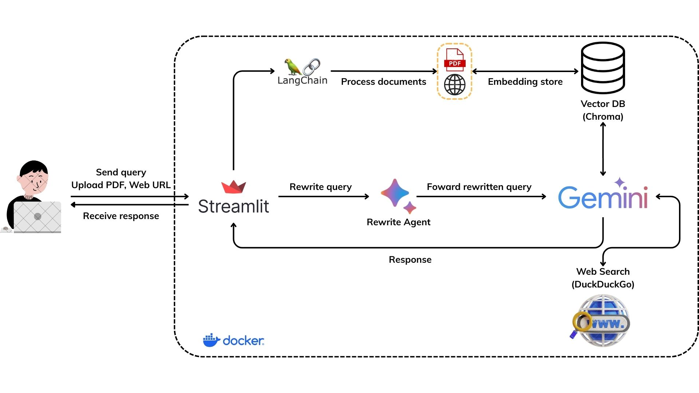

# Agentic RAG Streamlit Application

This project implements an Retrieval-Augmented Generation (RAG) system using **Gemini** and **Streamlit**. It allows users to ingest data from PDF files and web URLs, ask questions, and receive answers generated by a **Large Language Model (LLM)** leveraging the ingested context and optional web search results.


### How it works

* The user uploads PDF documents or provides web URLs, these documents are processed and stored in **Chroma** Vector Database.
* The user submits a query, the query is first sent to a **Rewrite Agent**. This agent analyzes and reformulates the original query, aiming to improve its clarity and effectiveness for retrieval.
* The rewritten query is forwarded to the LLM. The LLM searches the Vector DB (**Chroma**), retrieving relevant text chunks based on semantic similarity. Simultaneously or based on configuration, it can leverage Web Search (**DuckDuckGo**) to gather information not present in the uploaded documents. If no specific context found, the LLM answers based on its general knowledge.
* The generated Response is sent back to the Streamlit interface, where it is displayed to the user.

## Features

* **Data Ingestion:** Upload PDF files or enter web URLs to populate the knowledge base.
* **Persistent Vector Store:** Uses **ChromaDB** to store and retrieve text embeddings locally.
* **Query Rewriting:** Employs an agent with **Agno** to reformulate user questions for potentially better retrieval results.
* **Retrieval-Augmented Generation (RAG):**
    * Retrieves relevant text chunks from the **ChromaDB** vector store based on the (rewritten) query.
    * Uses a RAG agent (**Gemini**) to synthesize an answer based on the retrieved context.
* **Web Search:** Optionally performs a web search via **DuckDuckGo** if:
    * No relevant documents are found in the local vector store.
    * Web search is explicitly forced via the UI.
* **Configuration:** Allows users to configure:
    * Enabling/disabling web search.
    * Forcing web search.
    * Adjusting the similarity score threshold for document retrieval.
* **Database Management:** Options to clear chat history and the vector database.
* **Dockerized:** Includes a `Dockerfile` for easy containerization and deployment.

## Tech Stack

* **Web Framework:** Streamlit
* **Vector Database:** ChromaDB
* **LLM & Embeddings:** Gemini
* **Core Logic:** Langchain (for document processing, vector store integration), Agno (for agents)
* **Containerization:** Docker

## Prerequisites

* **Python:** Version 3.11 or higher recommended.
* **pip:** Python package installer.
* **Git:** For cloning the repository.
* **Docker:** Required for running the application using Docker (recommended for easy setup and persistence).
* **Google API Key:** You need an API key for Google Generative AI (e.g., Gemini API). You can obtain one from [Google AI Studio](https://aistudio.google.com/app/apikey).

## How to use
### Without Docker

1.  **Clone the Repository:**
    ```bash
    git clone https://github.com/luanntd/RAG-System-with-Gemini.git
    cd RAG-System-with-Gemini
    ```

2.  **Create a Virtual Environment (Recommended):**
    ```bash
    python -m venv venv
    # Activate it (Linux/macOS)
    source venv/bin/activate
    # Activate it (Windows)
    .\venv\Scripts\activate
    ```

3.  **Install Dependencies:**
    ```bash
    pip install -r requirements.txt
    ```

4. **Create Directory for Vector Store**
    ```bash
    mkdir chroma_db
    ```

5.  **Set Up Environment Variables:**
    * Create a file named `.env` in the project's root directory.
    * Add the following variables:

        ```dotenv
        GOOGLE_API_KEY=YOUR_GOOGLE_API_KEY
        COLLECTION_NAME=rag_system
        DB_PATH=chroma_db
        ```
    * Replace `"YOUR_GOOGLE_API_KEY"` with your actual Google API key.

6. **Running the Application**
    ```bash
    streamlit run main.py
    ```

### With Docker (Recommended)

You need to do steps 1 and 5 above before this.

1.  **Build the Docker Image:**
    ```bash
    docker build -t rag-system .
    ```

2.  **Run the Docker Container:**
    * Create the volume:
        ```bash
        docker volume create chroma_data
        ```
    * Run the container:
        ```bash
        docker run -d \
            -p 8501:8501 \
            --env-file ./.env \
            -v chroma_data:/chroma_db \
            --name rag-system-container \
            rag-system
        ```

    * **Explanation of `docker run` flags:**
        * `-d`: Run the container in detached mode (in the background).
        * `-p 8501:8501`: Map port 8501 on your host machine to port 8501 inside the container.
        * `--env-file ./.env`: Load environment variables from your local `.env` file into the container.
        * `-v rag_chroma_data:/app/chroma_db`: Mounts persistent storage. It links the named volume `chroma_data` to the `/chroma_db` directory *inside* the container. This path (`/chroma_db`) is where ChromaDB will store its data.
        * `--name rag-system-container`: Assigns a name to your running container.
        * `rag-system`: The name of the Docker image you built.

3.  **Access the Application:**
    * Open your web browser and navigate to `http://localhost:8501`.

## Demo

